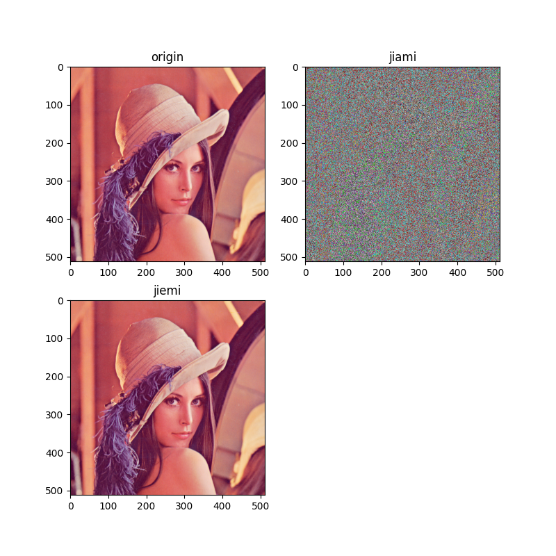
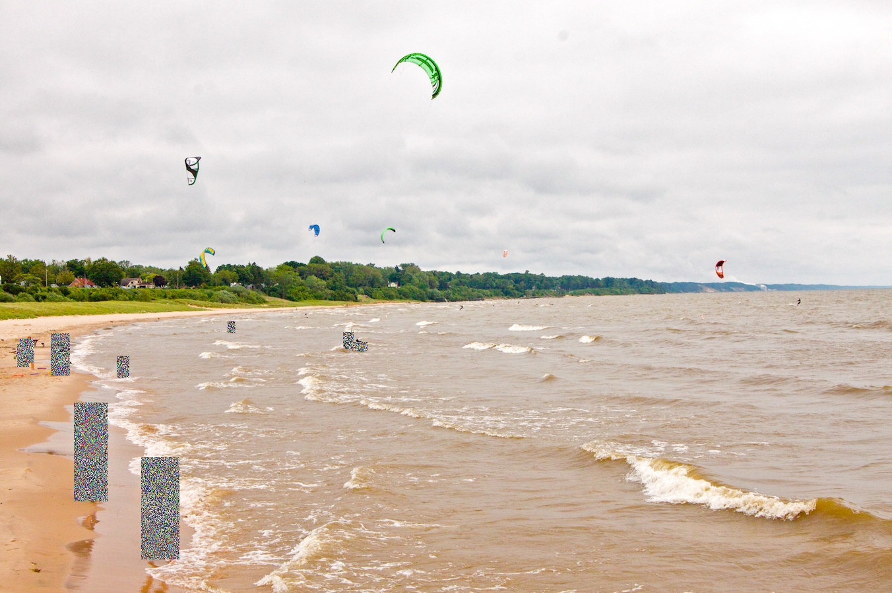

# images_encryption
### 简介
本项目是基于地平线x3派的，对图像进行识别并进行加解密的项目（为了应付密码学大作业）
### 加密算法
加密算法采用混沌加密算法，将图片分成三个通道进行加解密。效果如下

### 分割加密结果
图像识别采用yolo_v3模型，关于输出结果的处理在restore和postprocess中，加密结果如下

### 隐写
对于解密方，需要知道什么位置进行了加密，所以用图像隐写技术将坐标隐写于加密图像中
### 解密
将隐写数据读出来后，通过密钥解密

